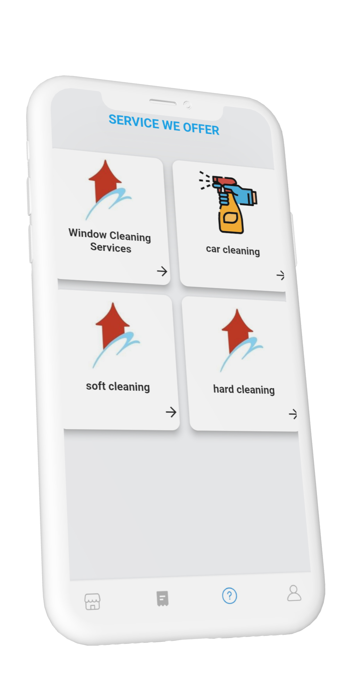
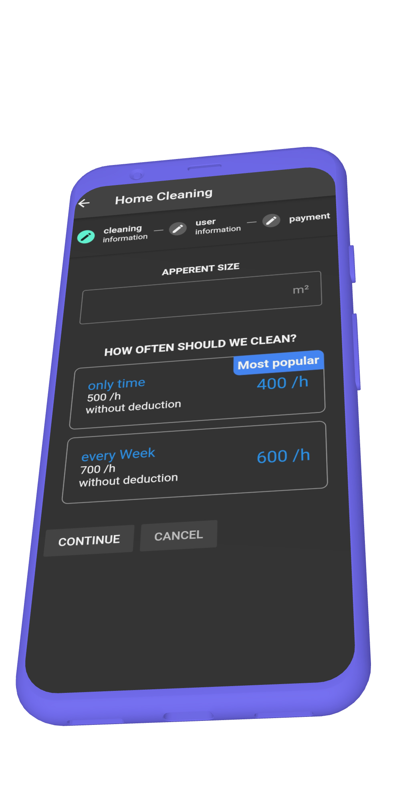
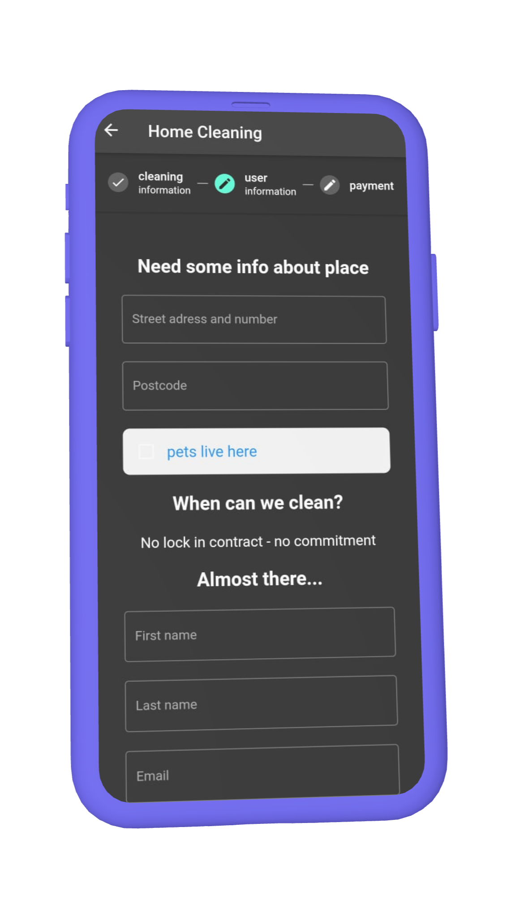
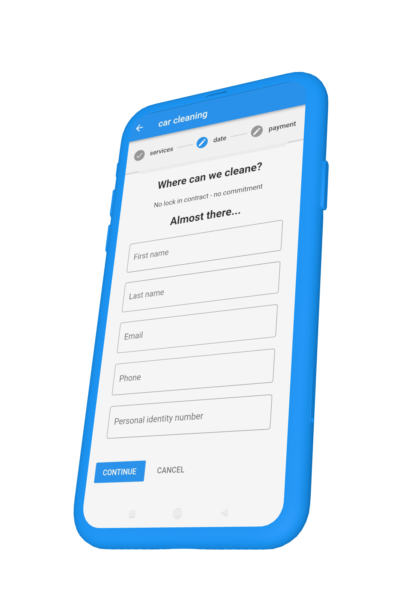
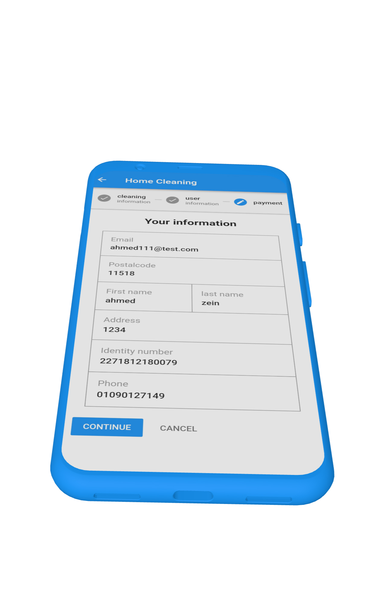
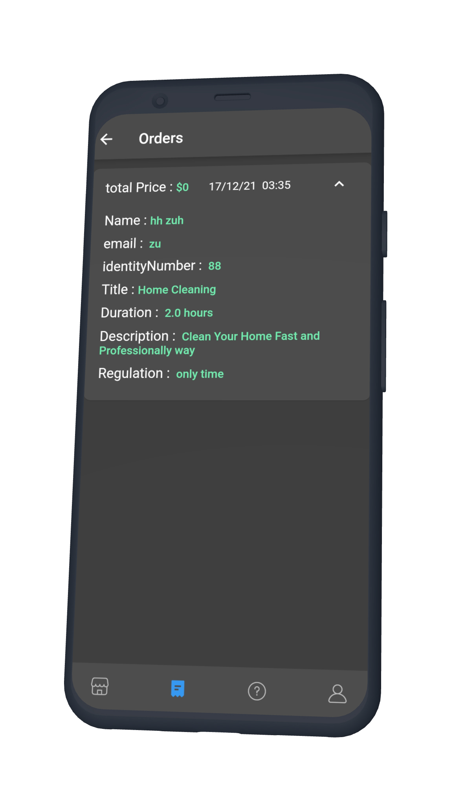
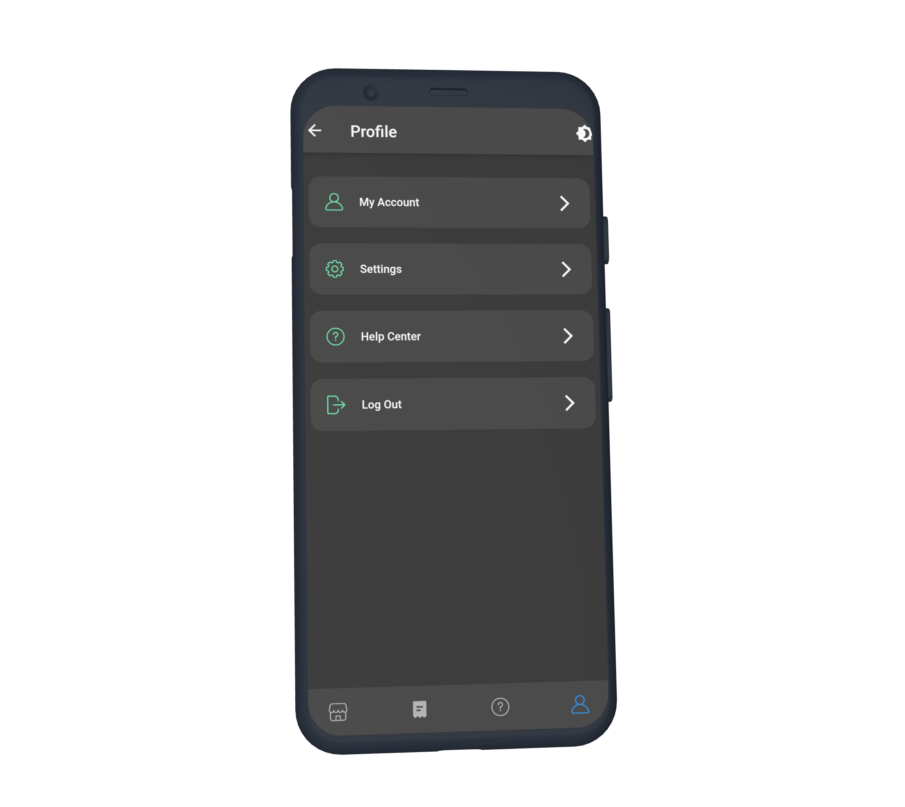
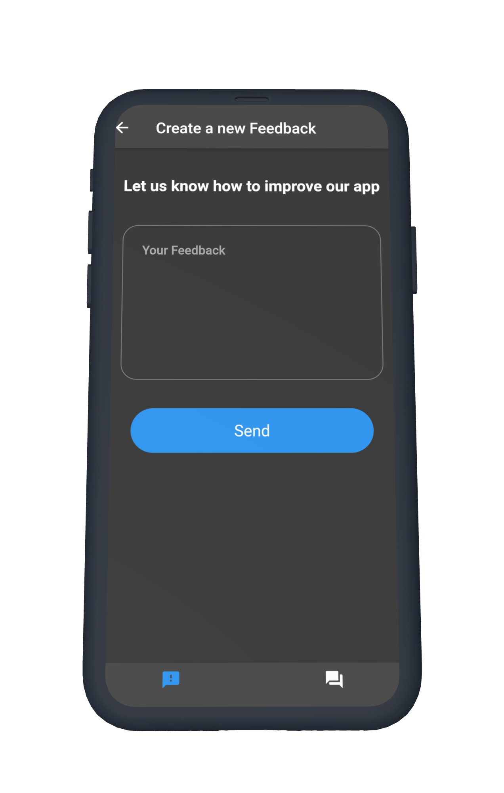
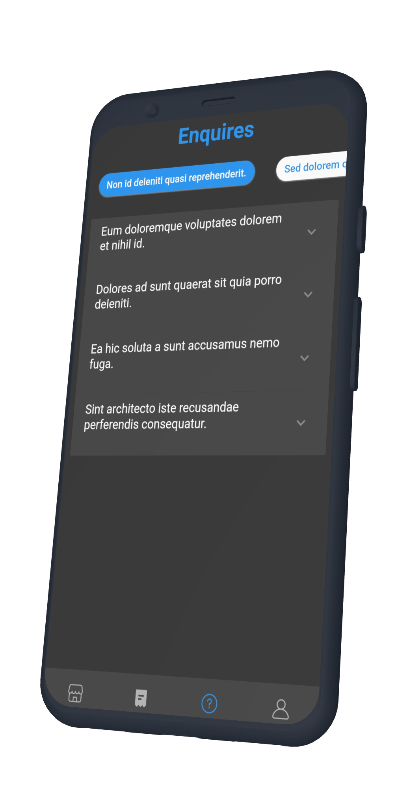
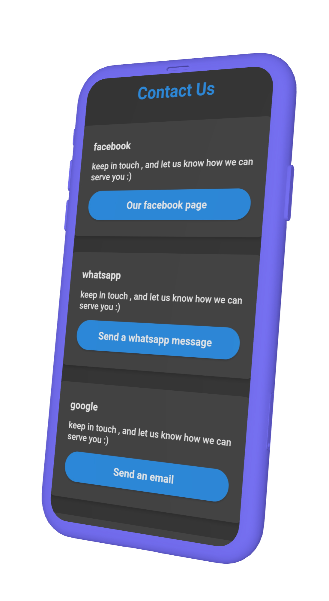

# clean_services_app

A new Flutter project.

**Packages :**

- flutter_svg:
- google_sign_in:
- firebase_auth: 
- firebase_core: 
- provider:
- graphql_flutter: 
- shared_preferences: 
- fluttertoast: 
- scratcher: 
- confetti: 
- translator:
- intl_utils:
- webview_flutter: 
- double_back_to_close_app:
- url_launcher:       

### Video Preview of Clean Services App

## Screens it contains:

=> Welcome

=> Login

=> Sign Up

=> Scratch off a new user gift card

=> Home Page

=> Create a feedback

=> Feedbacks

=> Enquiries

=>  Contactus

=> Profile

=> Cleaning information

=> User information

=> Order

=> OrderHistory

=> Payment

=> settings

## Photos

